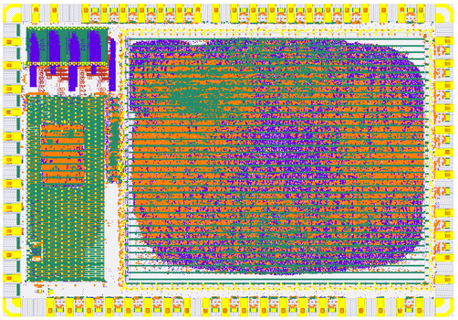

# SKY130 SHA3 Miner Caravel SOC



## Table of Contents

* [Introduction](#introduction)
* [Implementation](#implementation)
* [Miner Component](#miner-component)
	* [User block interface](#user-block-interface)
	* [Register file](#register-file)
	* [Status register](#status-register)
	* [Control register](#control-register)
	* [Verilog Module Hierarchy](#verilog-module-hierarchy)
* [Building](#building)
	* [Prerequisites](#prerequisites)
	* [Synthesizing](#Synthesizing)
	* [Future](#future)
* [Picorv32 Firmware](#picorv32-firmware)
* [Acknowledgments](#acknowledgments)

## Introduction

In mining a proof-of-work (POW) is used to verify the authenticity of a blockchain entry.
What is a POW?
A POW is a mathematical puzzle which is difficul to solve but easy to verify.

For this example a SHA3 mining core is defined for a hypothetical blockchain that uses the
SHA3-256 hash.
Finding a hash that meets certain conditions is difficult, verifying it does
is simple.

The core is implemented on Skywater's SKY130 process curtesy of the
[Open MPW Shuttle Program] sponsored by Google.

We are given:

- H: 256 bit header (Fixed value input)
- N: 64 bit nonce (The value we must find)
- D: 256 bit difficulty (Problem difficulty, smaller value = more difficult)

The problem we need to solve is to find any value of N, such that the SHA3-256 hash of the nonce concatenated
to the header, is less than or equal to the difficulty:

D >= SHA3({H, N})

NOTE: This will not mine a real blockchain. It intended as an exaple of hashing algorithm optimized
for mining using a multi-stage permutation pipeline.

## Implementation

This ASIC is generated using end-to-end open source EDA tools. A 12 stage pipeline design is
used in two phases since a fully unrolled 24 stage pipeline exceeds the capacity of this ASIC.

### Miner Component

The component is an Wishbone bus device with a 23 word memory mapped register file for control and status. All user project Verilog source is contained in the verilog/rtl/sha3_256_miner* files/

#### User block interface.

| Signal | Width | Description |
| --- | --- | ---
| wb_clk_i | 1 |  50MHz Wishbone bus clock (1-bit input) |
| wb_rst_i | 1 |  Asynchronous reset (1-bit input) |
| wbs_stb_i | 1 |  Select |
| wbs_cyc_i | 1 |  Active bus cycle |
| wbs_we_i | 1 |  Write enable |
| wbs_sel_i | 4 |  Byte lane select |
| wbs_dat_i | 32 |  Input data |
| wbs_adr_i | 32 |  Address |
| wbs_ack_o | 1 |  Bus ccycle acknowledge |
| wbs_dat_o | 32 |  Output data |
| io_in | MPRJ_IO_PADS |  IO pin bus input |
| io_out | MPRJ_IO_PADS |  IO pin bus output |
| io_oeb | MPRJ_IO_PADS |  IO pin bus output enable |
| user_clock2 | 1 | 300 MHz miner core clock  |
| irq_o | 1 |  Ative high when solution found (1-bit output) |

#### Register file

| Reg. # | Name | Read/Write | Description|
| --- | --- | --- | --- |
| 0-1 | SOLN_REG | RO | 64-bit Solution |
| 2 | STATUS_REG | RO | Status (see below) |
| 3 | SHA3_REG | RO | Fingerprint "SHA3" |
| 4-11 | HDR_REG | RW | 256-bit Header |
| 12-19 | DIFF_REG | RW | 256-bit difficulty |
| 20-21 | START_REG | RW | 64-bit start nonce |
| 22 | CTL_REG | RW | Control (see below) |

#### Status register

| Bit # | Name | Description |
| --- | --- | --- |
| 0 | FOUND | Solution found. Solution is stored and IRQ is set. IRQ cleared with next ctl. reg. read. |
| 1 | RUNNING | The run ctl bit is set and the solution nonce is auto-incrementing |
| 2 | TESTING | The test ctl bit is set and compare diff equal |

#### Control register

| Bit # | Name | Description |
| --- | --- | --- |
| 0 | RUN | 0 - clear, 1 - auto increment the solution nonce and check hashes |
| 1 | TEST | 0 - normal mode, 1 - test mode, look for exact match with diff |
| 2 | HALT | 0 - normal mode, 1 - halt mining and raise interrupt |
| 23-16 | PAD_LAST | last pad byte, 0x80 for KECCACK-256 and SHA3-256 |
| 31-24 | PAD_FIRST | first pad byte, 0x01 for KECCACK-256, and 0x06 for SHA3-256 |

#### Verilog Module Hierarchy

```
Top module:  \user_proj_example
Used module:     \sha3_256_miner_core
Used module:         \sha3_256_miner_round
Used module:             \permutation
Used module:     \sha3_256_miner_regs
Parameter \STAGES = 8

```

## Building

### Prerequisites

[Caravel]

[Openlane]

[Google Skywater PDK]

### Synthesizing

From the command line:
```
git clone https://github.com/miscellaneousbits/caravel_sha3_256_crypto_miner.git
cd caravel_sha3_256_miner/openlane
make user_proj_example
make user_project_wrapper
cd ..
make ship
```

This will create the artifacts for sending to the fab.

NOTE: This project is borderline routable at this point. Since the autorouter starts
off with a random seed, it will occasionally not converge on 0 violations.

### Future

Currently this 12 stage pipeline design is fully autorouted and uses about 990,000 cells and is the
most that can be crammed into the available die space. The layout is very sparse in order to get
successful routing. It may be possible to optimize and harden smaller repeating blocks
the place then manually to achieve a fully unrolled 24 stage pipeline. This would achieve
twice the performance of the current version.

## Picorv32 Firmware

TBD

## Acknowledgments

Many thanks to Mohamed Kassem, Tim Edwards, Sylvain Munaut, Philipp Gühring, and many others without whose help
this project would not be possible.

Long live open-everything.

[Caravel]: https://github.com/efabless/caravel.git
[Openlane]: https://github.com/efabless/openlane.git
[Google Skywater PDK]: https://github.com/google/skywater-pdk.git
[Open MPW Shuttle Program]: https://www.efabless.com/open_shuttle_program
